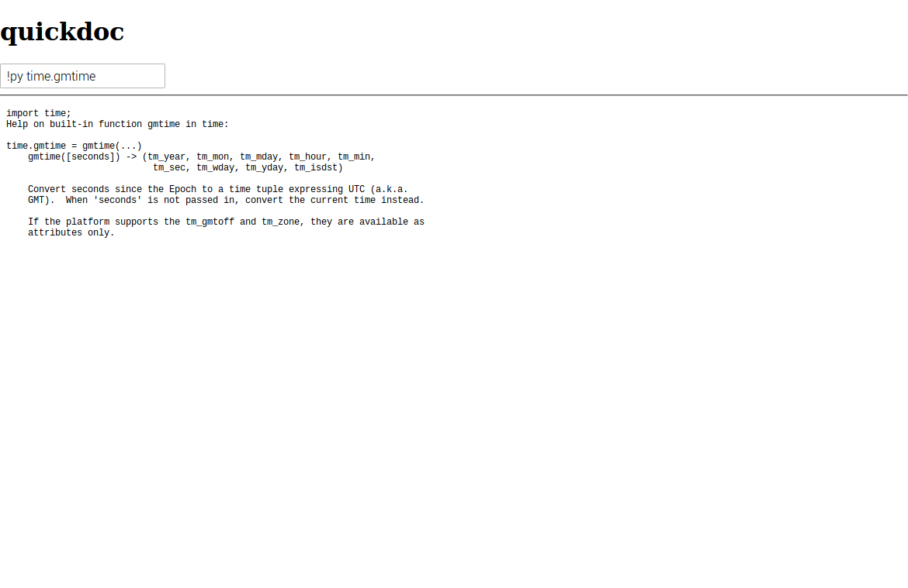

# quickdoc

Quick, offline, minimalist documentation.

A bit like [zeal][], but uses the docs on the local system.

[zeal]: https://zealdocs.org/

Support for:

- Go stdlib (via `go doc`)
- Python (via `help()`)
- Man
- commandline programs (via the `--help` flag)
